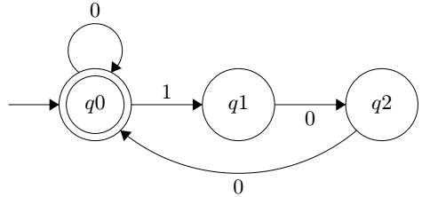
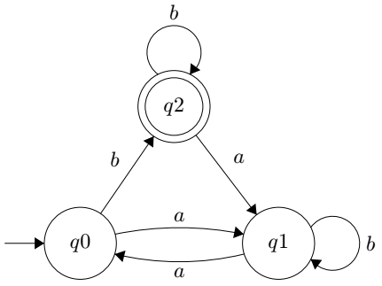
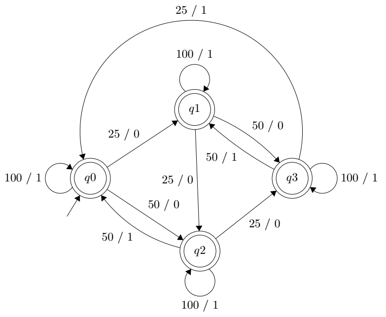

# Autômatos e Máquina de Mealy
 
Trabalho desenvolvido na disciplina Teoria da Computação do Programa de Pós-Graduação em Ciência da Computação (PPGCC) da Universidade Federal do Pará (UFPA) em 2021.1.

O trabalho consiste em densenvolver autômato finito e máquina de Mealy para determinadas tarefas, conforme descrito abaixo.

## [Autômato](automato.py)

Implementar um autômato finito deterministico (AFD) que aceitem as seguintes cadeias:

* Todas as cadeias em {0,1}* que apresentam cada 1 seguido imediatamente de dois 0.

* Todoas as cadeias em {a,b}* de modo que o último símbolo seja b e o número de símbolos a seja par.

## [Autômato para busca de padrão](automato_buscaPadrao.py)

Implementar um autômato finito que reconheça todas as ocorrências da palavra computador no texto T. O programa deve apontar em quais posições ocorreram o casamento exato da palavra.

T = “O computador é uma máquina capaz de variados tipos de tratamento automático de informações ou processamento de dados. Entende se por computador um sistema físico que realiza algum tipo de computação. Assumiu se que os computadores pessoais e laptops são ícones da era da informação . O primeiro computador eletromecânico foi construído por Konrad Zuse (1910 1995). Atualmente, um microcomputador é também chamado computador pessoal ou ainda computador doméstico.”

|     | Delta |  c |  o |  m |  p |  u |  t |  a |  d |  r  |  T |
|:---:|:-----:|:--:|:--:|:--:|:--:|:--:|:--:|:--:|:--:|:---:|:--:|
|  |   q0  | q1 | q0 | q0 | q0 | q0 | q0 | q0 | q0 |  q0 | q0 |
|     |   q1  | q1 | q2 | q0 | q0 | q0 | q0 | q0 | q0 |  q0 | q0 |
|     |   q2  | q1 | q0 | q3 | q0 | q0 | q0 | q0 | q0 |  q0 | q0 |
|     |   q3  | q1 | q0 | q0 | q4 | q0 | q0 | q0 | q0 |  q0 | q0 |
|     |   q4  | q1 | q0 | q0 | q0 | q5 | q0 | q0 | q0 |  q0 | q0 |
|     |   q5  | q1 | q0 | q0 | q0 | q0 | q6 | q0 | q0 |  q0 | q0 |
|     |   q6  | q1 | q0 | q0 | q0 | q0 | q0 | q7 | q0 |  q0 | q0 |
|     |   q7  | q1 | q0 | q0 | q0 | q0 | q0 | q0 | q8 |  q0 | q0 |
|     |   q8  | q1 | q9 | q0 | q0 | q0 | q0 | q0 | q0 |  q0 | q0 |
|     |   q9  | q1 | q0 | q0 | q0 | q0 | q0 | q0 | q0 | q10 | q0 |
| Fin |  q10  | q1 | q0 | q0 | q0 | q0 | q0 | q0 | q0 |  q0 | q0 |

\rightarrow

## [Máquina de Mealy](maquina_mealy.py)

Implementar um transdutor finito (máquina de Moore ou Mealy) que, dada uma sequência de moedas de 25 e 50 centavos e de 1 real, forneça uma lata de refrigerante quando a sequência totalizar 1 real ou mais. Cada moeda inserida deverá corresponder a uma de duas saídas: 0, se uma lata não pode ser (ainda) liberada, ou 1, se u ma lata deve ser liberada. Exemplo:

| Entrada: | 50 | 25 | 50 | 100 | 25 | 50 | 10 | ... |
|:--------:|:--:|:--:|:--:|:---:|:--:|:--:|:--:|:---:|
|  Saída:  |  0 |  0 |  1 |  1  |  0 |  1 |  1 | ... |

